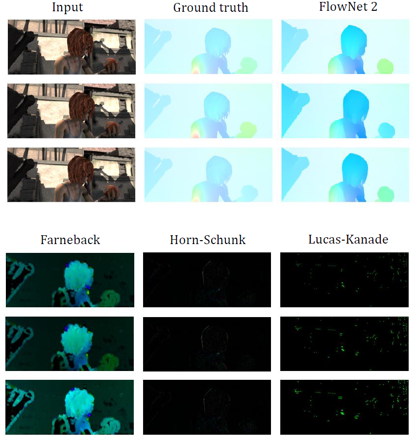

# OpticalFlow

This repository consists of four different optical flow approaches and can be demonstrated in `main.ipynb`.

| Method            | Paper                   |
| ----------------- |:----------------------- |
| FlowNet 2         | [FlowNet 2.0: Evolution of Optical Flow Estimation with Deep Networks](https://openaccess.thecvf.com/content_cvpr_2017/papers/Ilg_FlowNet_2.0_Evolution_CVPR_2017_paper.pdf)   |
| Farneback         | [Two-Frame Motion Estimation Based on Polynomial Expansion](http://www.diva-portal.org/smash/get/diva2:273847/FULLTEXT01.pdf)     |
| Horn-Schunck      | [Determining Optical Flow](https://dspace.mit.edu/bitstream/handle/1721.1/6337/%EE%80%80AIM%EE%80%81-572.pdf?sequence=2)     |
| Lucas-Kanade      | [An Iterative Image Registration Technique with an Application to Stereo Vision](http://cseweb.ucsd.edu/classes/sp02/cse252/lucaskanade81.pdf)    | 

The following optical flow is generated by FlowNet 2.

    

## Usage
Use [Colab's chrome extension](https://chrome.google.com/webstore/detail/open-in-colab/iogfkhleblhcpcekbiedikdehleodpjo) or provide a ipynb URL at http://colab.research.google.com/github/ to open `main.ipynb` and walkthrough four different approaches.

## Results on MPI-Sintel

    

